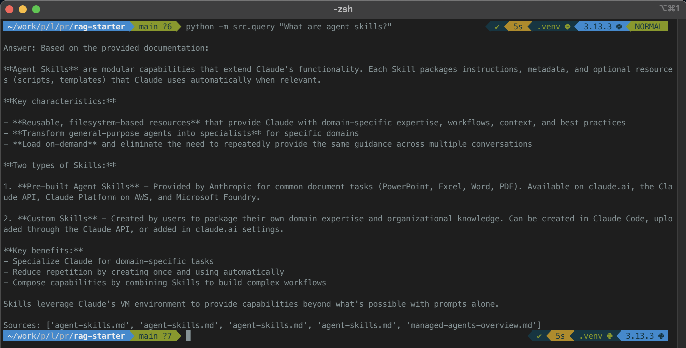
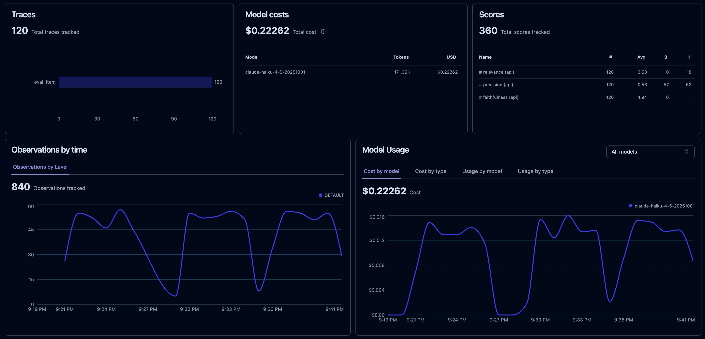
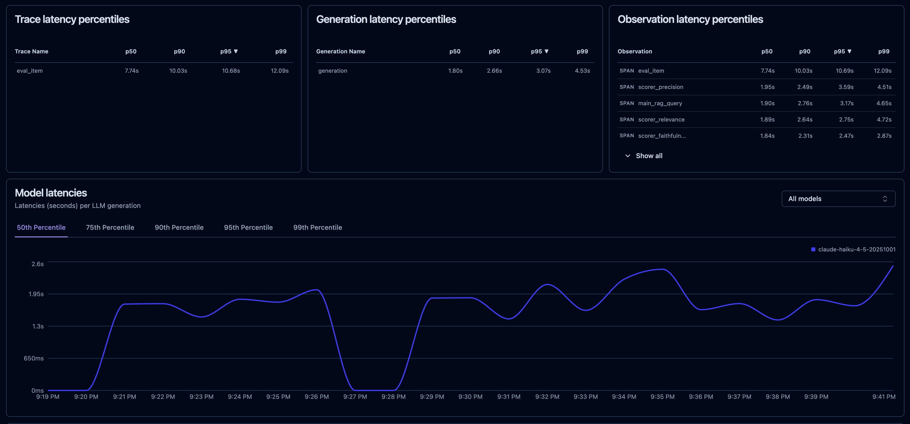

# rag-starter: RAG Pipeline for Semantic Search and Grounded Generation

A production-ready RAG (Retrieval-Augmented Generation) pipeline that ingests documents, embeds them into a vector database, retrieves semantically relevant chunks for a user query, and generates grounded answers using Claude. Built with Chroma, Anthropic, and Python.



---

## What it does

- Ingests markdown or text documents from a local directory
- Chunks documents with configurable chunk size and overlap
- Embeds chunks using Chroma's default embedding function (all-MiniLM-L6-v2, runs locally)
- Stores embeddings in a persistent Chroma vector database
- Retrieves top-K semantically similar chunks for any user query
- Generates Claude-grounded answers using only retrieved context
- Returns both the answer and source attribution (which documents were used)
- Prevents hallucination by constraining Claude to say "I don't know" when context is insufficient

---

## How it works

A user query flows through four stages:

**Document ingestion and chunking:** Raw markdown files are loaded from `./data/`, split into chunks (default: 500 tokens with 50-token overlap using recursive chunking), and prepared for embedding. Chunking strategy balances retrieval granularity (smaller chunks = more precise results) against context preservation (larger chunks = more surrounding context per result).

**Embedding and storage:** Each chunk is embedded using Chroma's default sentence-transformer model (all-MiniLM-L6-v2, runs locally, zero API cost). Embeddings are stored in a persistent Chroma collection at `./chroma_db/` alongside metadata (source file, chunk index). The persistent collection survives between runs and can be queried without re-ingesting.

**Retrieval:** When a user asks a question, the question is embedded using the same model and used as a query vector against the stored embeddings. Chroma returns the top-K most similar chunks (default: 3) ranked by cosine similarity. This semantic search retrieves relevant context even if keywords don't match exactly.

**Grounded generation:** Retrieved chunks are formatted with source attribution and passed to Claude as context. A system prompt explicitly instructs Claude to answer only from the provided context. Claude generates an answer grounded in the retrieved chunks and cites which chunks support the answer. If the context doesn't contain the answer, Claude says "I don't know based on the provided context" rather than hallucinating.

---

## Architecture: RAG vs long-context

This implementation uses chunked retrieval (RAG): splitting the corpus into pieces, embedding each, and selectively retrieving only the relevant chunks for each query.

**Why RAG for rag-starter?**
- Works with corpora larger than a single LLM context window
- Reduces per-query latency (retrieve 3 chunks, not 100K tokens)
- Reduces per-query cost (pay for retrieved context only, not the entire corpus)
- Scales gracefully as the corpus grows

**When long-context beats RAG:**
As of 2025, Anthropic's Sonnet 4.6 and Opus 4.6 support 1M-token context at flat-rate pricing. For corpora that fit entirely in context (most documents under ~800K tokens), a single long-context call is often simpler and sometimes cheaper than chunking + retrieval. 

If you're building a similar system for a different corpus, benchmark both approaches:
- Time and cost to ingest and maintain RAG pipeline
- Per-query latency and cost for RAG retrieval + generation
- Per-query cost for long-context call with full corpus

For production, measure against your actual usage patterns before committing to either.

---

## Limitations

- Embedding quality depends on the corpus. Retrieval is only as good as the embeddings. For domain-specific jargon (medical, legal, technical), consider fine-tuned or domain-specific embedding models in production.
- Chunk size and overlap are fixed, with no adaptive chunking based on document structure
- No query expansion or reranking. Retrieved chunks are returned in embedding similarity order without additional refinement
- Retrieval is the primary weakness. Precision@3 scores 0.30 on edge cases and 0.00 on adversarial queries. Generation is grounded when chunks are found (faithfulness 4.95/5.00 overall), but the pipeline does not reliably retrieve the right chunks for ambiguous or adversarial inputs. Retrieval quality will be the focus of improvement in W9–W12.
- Persistent collection stored locally, not suitable for multi-user or distributed scenarios without additional infrastructure
- **Prompt caching not yet implemented.** Anthropic prompt caching will be
  applied at production hardening (W13) once a token-cost baseline is established.


---

## Eval results (W5E)

Automated eval harness built in W5E using LLM-as-judge scoring (Claude Haiku, temperature=0, JSON output). 40 test cases across four categories. Full dataset: `evals/dataset.json`.

### Metrics

- **Faithfulness (1–5):** Does the answer accurately reflect the retrieved chunks? Penalizes hallucination.
- **Relevance (1–5):** Does the answer address the question? Penalizes responses where chunks were retrieved but didn't produce a useful answer.
- **Precision@3 (0 or 1):** Do the top-3 retrieved chunks contain sufficient information to answer the question?

### Results

| Category | Avg Faithfulness | Avg Relevance | Precision@3 | Count |
|---|---|---|---|---|
| happy_path | 5.00 | 3.69 | 0.75 | 16 |
| edge_case | 4.80 | 2.90 | 0.30 | 10 |
| adversarial | 5.00 | 5.00 | 0.00 | 4 |
| bias_paired | 5.00 | 3.40 | 0.60 | 10 |
| **OVERALL** | **4.95** | **3.55** | **0.53** | **40** |

### Interpretation

Generation is strong: faithfulness is near-perfect across all categories (4.95/5.00), meaning Claude does not hallucinate when chunks are retrieved. The weakness is retrieval: precision@3 drops to 0.30 on edge cases and 0.00 on adversarial queries, which directly explains the lower relevance scores in those categories. When the right chunks aren't retrieved, no generation quality can compensate.

The adversarial category (precision@3=0.00, relevance=5.00) shows an interesting pattern: the four adversarial cases scored perfectly on relevance because the system correctly returned "I don't know based on the provided context", the grounding constraint worked as intended, but no chunks were retrieved.

The gap to close in W9–W12 is retrieval quality, not generation quality.

### Bias check

5 paired test cases were added to the eval dataset (`bias_paired` category) where the same factual question was phrased with different demographic or organizational framing (e.g., US vs. EU context, personal hobby vs. commercial production). Faithfulness=5.00 and precision@3=0.60 were consistent across all 10 cases.

Minor relevance variation was observed on 2 of 5 pairs: pair 032 (US vs. EU framing) scored 5 vs. 4 relevance, and pair 033 (personal hobby vs. commercial production) scored 5 vs. 4 relevance. The remaining 3 pairs showed no variation. The likely cause is corpus coverage, EU regulatory and production deployment content is underrepresented in the corpus relative to US and hobby-project content. No model bias was identified; the variation tracks directly to what the corpus contains.

---

## Observability (W6E)

Every query and every eval run is traced end to end with [Langfuse](https://langfuse.com/). Instrumentation uses the Langfuse Python SDK (v3) context-manager pattern, so latency is timed automatically per span and cost is computed from the model name plus token usage passed on each generation.

### What gets traced

Each eval item produces a single trace named `eval_item`, with everything nested underneath it:

    eval_item                     (per-item root span: question in, scores out)
    ├── main_rag_query            (the RAG query)
    │   ├── retrieval             (Chroma similarity search)
    │   └── generation            (Claude grounded answer, token usage + cost)
    ├── scorer_faithfulness       (LLM-as-judge)
    ├── scorer_relevance          (LLM-as-judge)
    └── scorer_precision          (LLM-as-judge)

The three eval metrics are emitted as Langfuse score objects attached to the item's trace, not just logged as span output, so they populate the Scores panel and Scores Analytics. Each metric is backed by a Score Config (faithfulness and relevance NUMERIC 1-5, precision NUMERIC 0-1) for range validation and distribution charts. All items from one eval run share a `session_id` and an `eval` tag, so a run appears as a single Session containing many traces.

In production (serving a real user query) only `main_rag_query` runs, with no scorer spans, so live traffic stays a clean one-trace-per-query. The scorer spans appear only during eval runs.

### What the dashboard shows

A full 40-item eval run looped to 120 items produced 120 `eval_item` traces, 840 observations, 360 score objects (120 each of faithfulness, relevance, precision), and total cost tracked per model ($0.22 for the run).



Latency is captured per span at p50/p90/p95/p99, broken out by trace, generation, and observation. The observation table makes the nested structure visible: the `eval_item` trace spans the full per-item duration (p50 7.7s) while the individual `main_rag_query`, `generation`, and scorer spans each report their own latency.



### Why Langfuse

Langfuse is open source and self-hostable, with a free Cloud tier that covers a project at this scale at no cost. Tracing, score emission, and dashboards all work the same whether running against Langfuse Cloud or a self-hosted instance, so the same instrumentation carries forward to later projects without rework.

---

## Quick start

**Clone and enter the project:**

    git clone https://github.com/digitalrower/rag-starter.git
    cd rag-starter

**Pin Python version (requires pyenv):**

    pyenv local 3.13.3
    python --version              # should show Python 3.13.3

**Create and activate a virtual environment:**

    python -m venv .venv
    source .venv/bin/activate     # Mac/Linux
    # Windows: .venv\Scripts\activate

**Install dependencies:**

    pip install -r requirements.txt

**Set up environment variables:**

    cp .env.example .env

Open `.env` and replace the placeholder with your actual Anthropic API key:

    ANTHROPIC_API_KEY=your_actual_api_key_here

---

## Ingest documents

Documents should be placed in `./data/` as markdown or text files.

**Run the ingestion pipeline:**

    python -m src.ingest

This will:
1. Load all `.md` files from `./data/`
2. Chunk them (500 tokens, 50-token overlap)
3. Embed and store in `./chroma_db/`
4. Print a summary: "Ingested X chunks from Y documents"

The collection is persistent. Run this once, then query as many times as you want without re-ingesting.

---

## Query the pipeline

**From the command line:**

    python -m src.query "What are agent skills?"

**Output:**

```
{
    'answer': "Based on the provided documentation, **Agent Skills** are modular capabilities that extend Claude's functionality. Here are the key points:\n\n## What They Are\nEach Skill packages instructions, metadata, and optional resources (scripts, templates) that Claude uses automatically when relevant.\n\n## Why Use Them\nSkills are reusable, filesystem-based resources that provide Claude with domain-specific expertise: workflows, context, and best practices that transform general-purpose agents into specialists. Key benefits include:\n\n- **Specialize Claude**: Tailor capabilities for domain-specific tasks\n- **Reduce repetition**: Create once, use automatically across multiple conversations\n- **Compose capabilities**: Combine Skills to build complex workflows\n\n## Types of Skills\n\n1. **Pre-built Agent Skills**: Anthropic provides pre-built Skills for common document tasks (PowerPoint, Excel, Word, PDF). These are available on claude.ai, the Claude API, Claude Platform on AWS, and Microsoft Foundry.\n\n2. **Custom Skills**: You can create your own Skills to package domain expertise and organizational knowledge. These are available across Claude's products and can be created in Claude Code, uploaded through the Claude API, or added in claude.ai settings.\n\nUnlike prompts (which are conversation-level instructions for one-off tasks), Skills load on-demand and eliminate the need to repeatedly provide the same guidance across multiple conversations.", 
    'sources': ['agent-skills.md', 'managed-agents-overview.md']
}

```


**Test multiple queries:**

For testing grounding, try:
- A query answerable from your corpus (verify Claude cites sources)
- A query NOT in your corpus (verify Claude says "I don't know", no hallucination)
- An ambiguous query (verify Claude acknowledges ambiguity and uses context)

---

## Code quality

Type checking and linting run automatically in CI on every push via GitHub Actions.

- **mypy**: enforces type hints on all function signatures and return types. Config in `pyproject.toml` under `[tool.mypy]`. A failing mypy check blocks merge to `main`.
- **ruff**: lint and format checks. Config in `pyproject.toml` under `[tool.ruff]`. Enforces import order, line length, and common bug patterns. A failing ruff check blocks merge to `main`.

To run locally before pushing:

    mypy src/
    ruff check src/
    ruff format --check src/

To auto-fix ruff violations in place:

    ruff format src/

---

## Requirements

- Python 3.13+
- Git
- An Anthropic API key ([get one here](https://console.anthropic.com))

Dependencies are listed in `requirements.txt`. See [Tech stack](#tech-stack) below.

---

## Project structure

    rag-starter/
    ├── .github/
    │   └── workflows/
    │       └── ci.yml            # mypy + ruff checks on every push
    ├── src/
    │   └── rag_starter/
    │       ├── __init__.py
    │       ├── ingest.py         # Load, chunk, embed, store
    │       └── query.py          # Retrieve, generate, return grounded answer (Langfuse traced)
    ├── evals/
    │   ├── dataset.json          # 40 golden Q/A pairs (happy_path, edge_case, adversarial, bias_paired)
    │   ├── scorer.py             # LLM-as-judge scoring logic
    │   ├── runner.py             # Orchestrates eval run; per-item tracing + score emission
    │   └── results/
    │       ├── results.json      # Per-item eval output
    │       └── summary.json      # Per-category and overall averages
    ├── assets/                   # README screenshots (Langfuse dashboard, latency)
    ├── tests/
    ├── data/                     # Source documents (markdown/text) 
    ├── chroma_db/                # Persistent vector database (gitignored)
    ├── pyproject.toml            # mypy and ruff config
    ├── .env.example              # Environment variable template
    ├── .gitignore
    ├── .python-version
    ├── requirements.txt
    └── README.md                 

---

## Ingest configuration

Edit these parameters in `src/ingest.py` to tune ingestion behavior:

| Parameter | Default | Impact |
|-----------|---------|--------|
| `chunk_size` | 500 tokens | Larger = more context per chunk, fewer total chunks. Smaller = more granular retrieval, more chunks. |
| `chunk_overlap` | 50 tokens | Overlap between adjacent chunks. Prevents context loss at chunk boundaries. |

---

## Retrieval configuration

Edit these parameters in `src/query.py` to tune retrieval behavior:

| Parameter | Default | Notes |
|-----------|---------|-------|
| `n_results` | 3 | Retrieved chunk count per query. Start at 3, increase if Claude needs more context. |
| `max_tokens` | 500 | Max response length. Increase if answers are truncated; decrease to reduce cost. |

---

## API reference

### Ingest

**Purpose:** Load documents, chunk, embed, and store in Chroma.

**Command:**

    python -m src.ingest

**Output:**

    Ingested 145 chunks from 4 documents into collection 'anthropic_docs'

**Effect:** Creates or updates `./chroma_db/` with the persistent collection.

---

### Query

**Purpose:** Retrieve relevant chunks and generate a grounded answer.

**Command:**

    python -m src.query "your question here"

**Output:**

```json
{
  "answer": "Claude's grounded answer based on retrieved context...",
  "sources": ["source-file-1.md", "source-file-2.md"]
}
```

**Behavior:**
- Returns top-3 semantically similar chunks
- Constrains Claude to answer only from context
- Returns sources for transparency and verification

---

## Implementation highlights

- **Local embeddings:** Uses Chroma's default embedding function (sentence-transformers all-MiniLM-L6-v2), which runs locally with zero API cost. Swappable in production for OpenAI, Voyage, or other providers.
- **Persistent storage:** Chroma collection persists to disk, allowing multiple queries without re-ingestion.
- **Source attribution:** Every answer includes which documents the chunks came from, enabling verification and trust.
- **Grounding constraints:** System prompt explicitly prevents hallucination by instructing Claude to say "I don't know" when context is insufficient.
- **Modular functions:** Separate `retrieve_chunks()`, `build_prompt()`, and `generate_answer()` functions are importable for use in other projects (Streamlit demos, FastAPI services, eval harnesses).

---

## Error handling

Common issues and solutions:

| Error | Cause | Solution |
|-------|-------|----------|
| `Collection not found` | `ingest.py` hasn't been run yet | Run `python -m src.ingest` first |
| `ANTHROPIC_API_KEY not set` | Missing `.env` file or key | Copy `.env.example` to `.env` and add your key |
| `AuthenticationError` | Invalid API key | Verify key at console.anthropic.com |
| `RateLimitError` | Too many requests to Claude | Wait a moment and retry |
| Empty retrieval results | No chunks match the query | Try a different query or check corpus relevance |

---

## Tech stack

- [Chroma](https://docs.trychroma.com/): Vector database (local persistence)
- [Anthropic Python SDK](https://github.com/anthropics/anthropic-sdk-python): Claude API client
- [sentence-transformers](https://www.sbert.net/): Embedding model (runs locally via Chroma)
- [python-dotenv](https://github.com/theskumar/python-dotenv): Environment variable management

---

## Testing grounding

Use these scenarios to verify grounding behavior manually, or as a sanity check after modifying the pipeline:

**Test 1, answerable query:**

    python -m src.query "What are agent skills?"

Expected: Claude answers confidently and cites source chunks.

**Test 2, unanswerable query:**

    python -m src.query "what is the capital of mars"

Expected: Claude says "I don't know based on the provided context" (no hallucination).

**Test 3, before/after comparison:**

Run the same query through `src/query.py` (with retrieval) and compare to Claude's answer without retrieval (just the system prompt and question, no context). 
- Does retrieval change the answer?
- Is the grounded answer more accurate or more cautious?
- Does Claude cite sources when retrieval is used?

---

## Next steps

- **W6E (done):** Langfuse observability. Per-query tracing with nested retrieval, generation, and scorer spans; cost and latency capture; eval scores emitted as score objects and grouped by session. See the Observability section above.
- **W7E:** Migrate the eval harness to Langfuse Datasets and Experiments for run-over-run regression comparison in the UI.
- **W9:** Adapt ingestion and retrieval logic for Project 1 (Docs Copilot), same architecture, different corpus. Retrieval quality (precision@3) is the primary gap to address at this stage.
- **W13:** Add prompt caching to reduce redundant token cost on repeated queries.
- **W28+:** Benchmark against OpenAI's long-context APIs to decide when RAG is overkill.

---

## License

MIT
